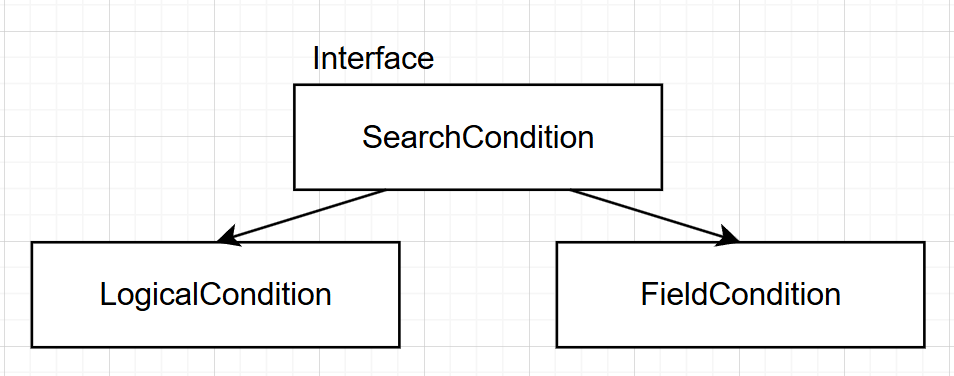

Distributed tracing приложение  
Стек: Spring Boot, ElasticSearch, Opentelemetry  
В стадии разработки

### Запрос для получения трейсов
#### Большинство данных задаются в query - классом SearchCondition

SearchCondition - интерфейс  
LogicalCondition - содержит список SearchCondition и бинарный оператор (AND, OR)  
FieldCondition - содержит Field - название поля, унарный оператор и значение поля  

Таким образом, можно создавать запросы любой вложенности  
Список поддерживаемых Field представлен в Swagger. Каждый унарный оператор связан со списком разрешенных Field.type

#### Поля, которые считаются с использованием агрегации...